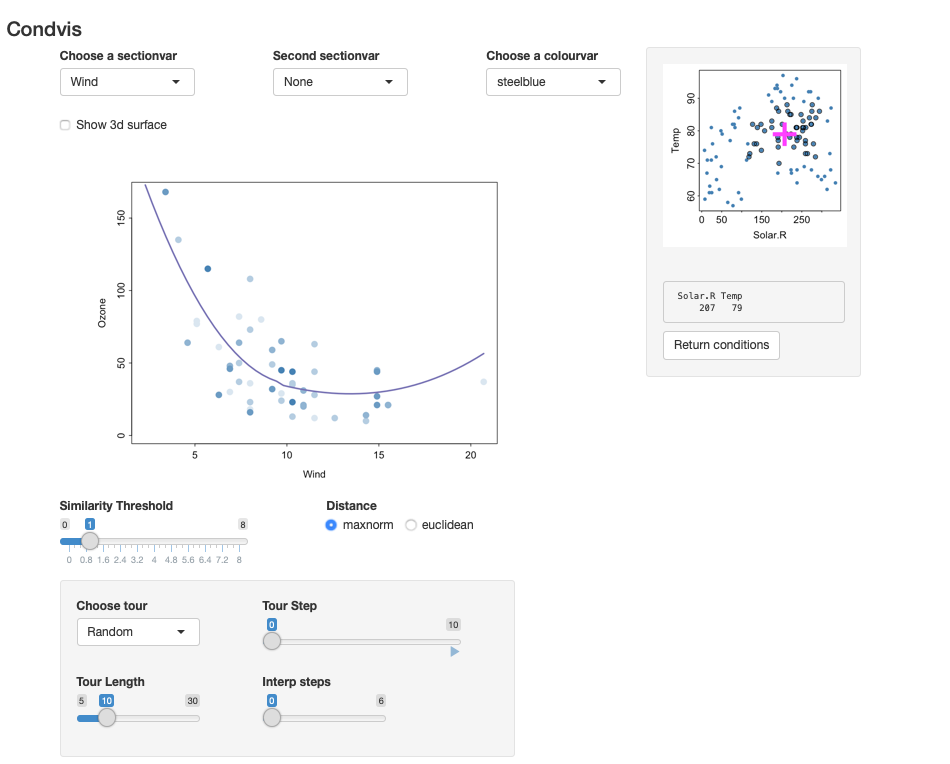

<!-- README.md is generated from README.Rmd. Please edit that file -->

```{r, echo = FALSE}
knitr::opts_chunk$set(
  collapse = TRUE,
  comment = "#>",
  fig.path = "README-"
)
```

# condvis2

The goal of condvis2 is to visualise prediction models via shiny.
Predictions are generated from one or more model fits.
Low-dimensional visualisations are constructed showing the relationship between the response
and one or two (section) predictors, conditional on the remaining predictors. The section predictors
and conditioning values are selected within the shiny app.

## Installation

You can install condvis2 from github with:

```{r gh-installation, eval = FALSE}
# install.packages("devtools")
devtools::install_github("cbhurley/condvis2")
```

## Example 1: A prediction model

This is a basic condvis example.

We will use the airquality data built in to R.

```{r}
ozone <- na.omit(airquality)
```

```{r eval=F}
fit <- loess(Ozone~Wind+Solar.R+Temp, data=ozone)
condvis(ozone, fit, sectionvars="Wind", conditionvars=c("Solar.R", "Temp"))
```

The result is shown in the screenshot below.
 It shows the loess prediction for Wind, conditional on values of the other two
 predictors.  
 Only observations whose Solar.R and Temp values are near (207,79) are shown.
 The user can move around the pink cross to see how the prediction varies.

```{r echo=FALSE, out.width='100%'}

```
Check out the vignette `Introduction to condvis2` for more information and details.


## Example 2: A density estimate

```{r eval=F}
library(ks)
data(iris)
irisf <- kde(x=iris[,1:3])

condvis(data = iris, model = list(kde=irisf), 
        sectionvars= c("Sepal.Length", "Sepal.Width"), 
        conditionvars= "Petal.Length", density=T)

```

The result is shown in the screenshot below. It shows the estimated density of  two
variables conditional on the third.

```{r echo=FALSE, out.width='100%'}
knitr::include_graphics('vignettes/iris.png')
```

## References


Catherine B. Hurley and Mark O'Connell and Katarina Domijan,
Interactive slice visualization for exploring machine learning models.
arXiv 2101.06986, 2021.

Mark O'Connell and Catherine Hurley and Katarina Domijan,
Interactive slice visualization for exploring machine learning models.
Journal of Statistical Software 81(5) 1--20, 2017.
