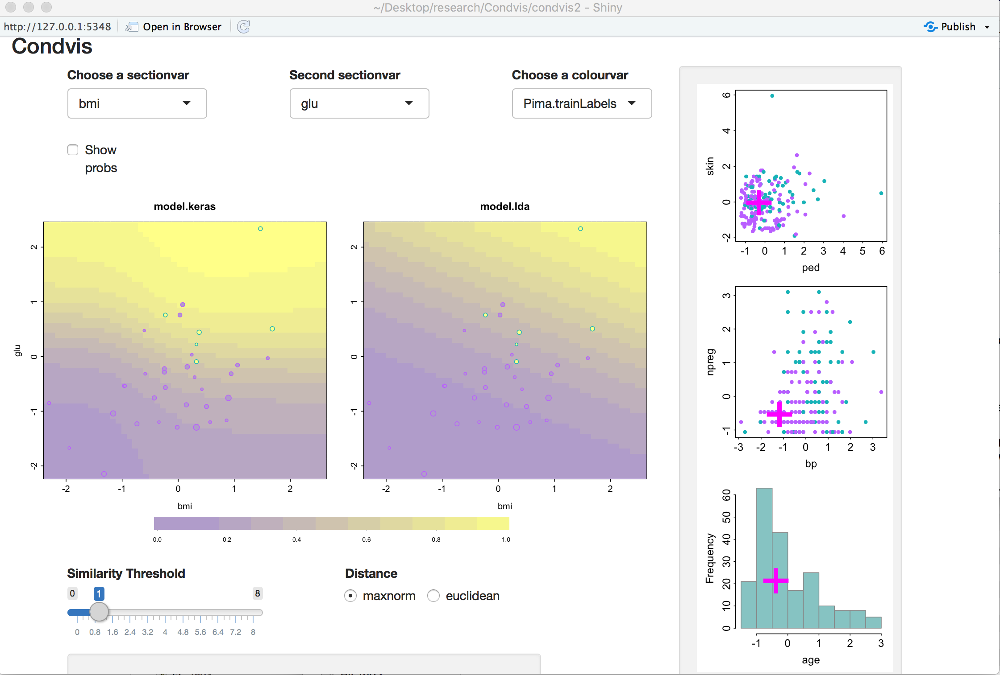
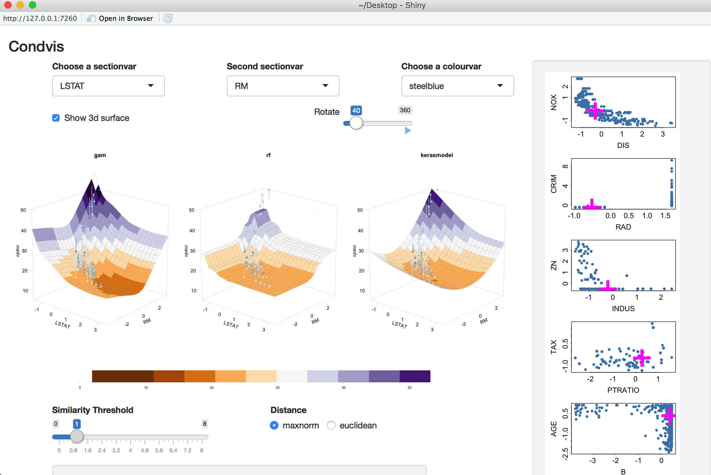

```{r setup, include = FALSE}
knitr::opts_chunk$set(
  collapse = TRUE,
  comment = "#>",
  fig.width=5, fig.height=5 ,fig.align="center"
)
```

`keras` is an R based interface to the [Keras](https://keras.io/): the Python Deep Learning library. It uses the [TensorFlow](https://www.tensorflow.org/) backend engine.

The basic workflow is to define a model object of class `keras.engine.training.Model` by initialising it using the `keras_model_sequential` function and then adding layers to it. Function  `fit` trains a Keras model. It requires the predictors (inputs) and responses (targets/labels) to be passed a two separate data objects as vector, matrix, or arrays. 

## Classification:


Use the Diabetes in Pima Indian Women dataset from library `MASS`
```{r}
library(keras)
library(condvis2)
library(MASS)
set.seed(123)
```

Prepare data for Keras and Condvis: 
```{r}
# Training features
Pima.training <- Pima.tr[,1:7]
# Testing features
Pima.testing <- Pima.te[,1:7]

# Scale the data
Pima.training <-as.matrix(scale(Pima.training))
means <- attr(Pima.training,"scaled:center")
sds<- attr(Pima.training,"scaled:scale")
Pima.testing <- as.matrix(scale(Pima.testing, center=means, scale=sds))

# One hot encode training target values
Pima.trainLabels <- to_categorical(as.numeric(Pima.tr[,8]) -1)[, 2]
# One hot encode test target values
Pima.testLabels <- to_categorical(as.numeric(Pima.te[,8]) -1)[, 2]

# Create dataframes for Condvis
dtf <- data.frame(Pima.training)
dtf$Pima.trainLabels <- Pima.tr[,8]

dtf.te <- data.frame(Pima.testing)
dtf.te$Pima.testLabels <- Pima.te[,8]
```


Define and fit the model:
```{r}

model <- keras_model_sequential() # Add layers to the model
model %>%
  layer_dense(units = 8, activation = 'tanh', input_shape = c(7)) %>%
  layer_dense(units = 1, activation = 'sigmoid')

# Print a summary of a model
summary(model)


# Compile the model
model %>% compile(
  loss = 'binary_crossentropy',
  optimizer = 'adam',
  metrics = 'accuracy'
)

# Fit the model
history <-model %>% fit(Pima.training, Pima.trainLabels,
              epochs = 500,
              batch_size = 50,
                  validation_split = 0.2,
              class_weight = as.list(c("0" = 1, "1"=3))
)
```
Condvis uses a generic `CVpredict` to provide a uniform interface to `predict` methods. For classification, the choice of `ptype` allows for output for each observation as:

- predicted class `ptype` = "pred" (default)
- predicted probability for the last class `ptype` = "prob" (e.g. $P(X=1)$ in binary classification).
- matrix of predicted probabilities for each class `ptype` = "probmatrix"

```{r}
CVpredict(model, dtf.te[1:10,], response=8, predictors=1:7)
CVpredict(model, dtf.te[1:10,], response=8, predictors=1:7, ptype="prob")
CVpredict(model, dtf.te[1:10,], response=8, predictors=1:7, ptype="probmatrix")
```


Note that `keras` models do not use the formula interface, so one needs to specify the name of response and predictors for `CVpredict`. When creating the Condvis shiny app, arguments for `CVpredict` can be passed in `condvis` using `predictArgs` argument.

Calculate model accuracy from:

```{r}
mean(CVpredict(model, dtf.te, response=8, predictors=1:7) == dtf.te$Pima.testLabels)
```


Compare to LDA:

```{r}

fit.lda <- lda(Pima.trainLabels~., data = dtf)
mean(CVpredict(fit.lda, dtf.te) == dtf.te$Pima.testLabels)

```

LDA scores higher on accuracy. It is known that a linear model performs best for this dataset.

```{r eval=F}

kArgs1 <-  list(response=8,predictors=1:7, ptype="prob")
kArgs2 <-  list(response=8,predictors=1:7, ptype="prob")
condvis(dtf, list(model.keras = model, model.lda = fit.lda), sectionvars = c("bmi", "glu"), response="Pima.trainLabels",predictArgs = list(kArgs1, kArgs2), pointColor = "Pima.trainLabels")

```


```{r echo=FALSE, out.width='100%'}

```


### Tour controls

To view a tour through the space where the fits differ: select `Choose tour` option `Diff fits` and click on the arrow below `Tour Step` to watch.
You can increase the number of  points via the `Tour Length` slider.


## Regression:


Use the Boston housing data. This is one of the examples from [keras](https://keras.rstudio.com/reference/dataset_boston_housing.html)

Prepare data:
```{r}
boston_housing <- dataset_boston_housing()
c(train_data, train_labels) %<-% boston_housing$train
c(test_data, test_labels) %<-% boston_housing$test

# Normalize training data
train_data <- scale(train_data)

# Use means and standard deviations from training set to normalize test set
col_means_train <- attr(train_data, "scaled:center")
col_stddevs_train <- attr(train_data, "scaled:scale")
test_data <- scale(test_data, center = col_means_train, scale = col_stddevs_train)

```


Fit the model:
```{r}
build_model <- function() {

  model <- keras_model_sequential() %>%
    layer_dense(units = 64, activation = "relu",
                input_shape = dim(train_data)[2]) %>%
    layer_dense(units = 64, activation = "relu") %>%
    layer_dense(units = 1)

  model %>% compile(
    loss = "mse",
    optimizer = optimizer_rmsprop(),
    metrics = list("mean_absolute_error")
  )

  model
}

model <- build_model()
model %>% summary()


# Display training progress by printing a single dot for each completed epoch.
print_dot_callback <- callback_lambda(
  on_epoch_end = function(epoch, logs) {
    if (epoch %% 80 == 0) cat("\n")
    cat(".")
  }
)

epochs <- 500

# Fit the model 
early_stop <- callback_early_stopping(monitor = "val_loss", patience = 20)

model <- build_model()
history <- model %>% fit(
  train_data,
  train_labels,
  epochs = epochs,
  validation_split = 0.2,
  verbose = 0,
  callbacks = list(early_stop, print_dot_callback)
)

```

Create dataframes for `condvis`:
```{r}

column_names <- c('CRIM', 'ZN', 'INDUS', 'CHAS', 'NOX', 'RM', 'AGE',
                  'DIS', 'RAD', 'TAX', 'PTRATIO', 'B', 'LSTAT')
train_df <- data.frame(train_data)
colnames(train_df) <- column_names
train_df$medv <- train_labels

test_df <- data.frame(test_data)
colnames(test_df) <- column_names
test_df$medv <- test_labels

```
Fit some other models for comparison (a random forest and a generalised additive model):

```{r}
suppressMessages(library(mgcv))
gam.model = gam(medv ~ s(LSTAT) + s(RM) + s(CRIM), data=train_df)

suppressMessages(library(randomForest))
rf.model <- randomForest(formula = medv ~ ., data = train_df)

```

Use `CVpredict` to compare RMSE in the scaled data:

```{r}
mean((test_labels - CVpredict(model, test_df, response=14, predictors=1:13))^2)
mean((test_labels - CVpredict(gam.model, test_df))^2)
mean((test_labels - CVpredict(rf.model, test_df))^2, na.rm=TRUE)
```

RF gives the best fit. 

```{r eval = FALSE}

kArgs <-  list(response=14,predictors=1:13)
condvis(train_df, list(gam = gam.model, rf = rf.model, kerasmodel = model), sectionvars = c("LSTAT", "RM"),predictArgs = c(kArgs, kArgs, kArgs) )

```

Ticking `Show 3d surface` shows the 3d-surface of the fit and you can use the `Rotate` slider to rotate them around the z-axis.

```{r echo=FALSE, out.width='100%'}

```

Random forest gives a `blockier` fit, compared to the smooth gams and the neural net. The fit ios more flexible in the areas where there is more data points.


