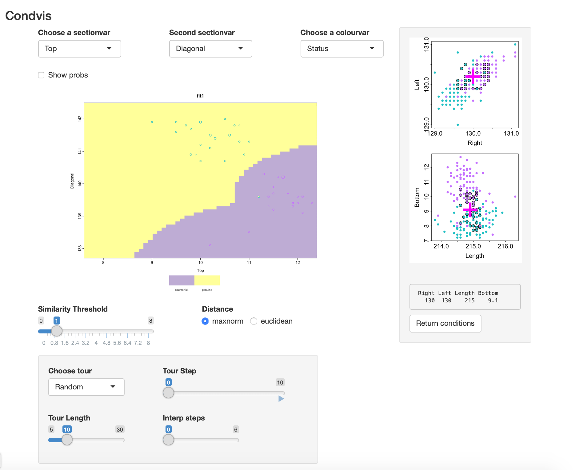
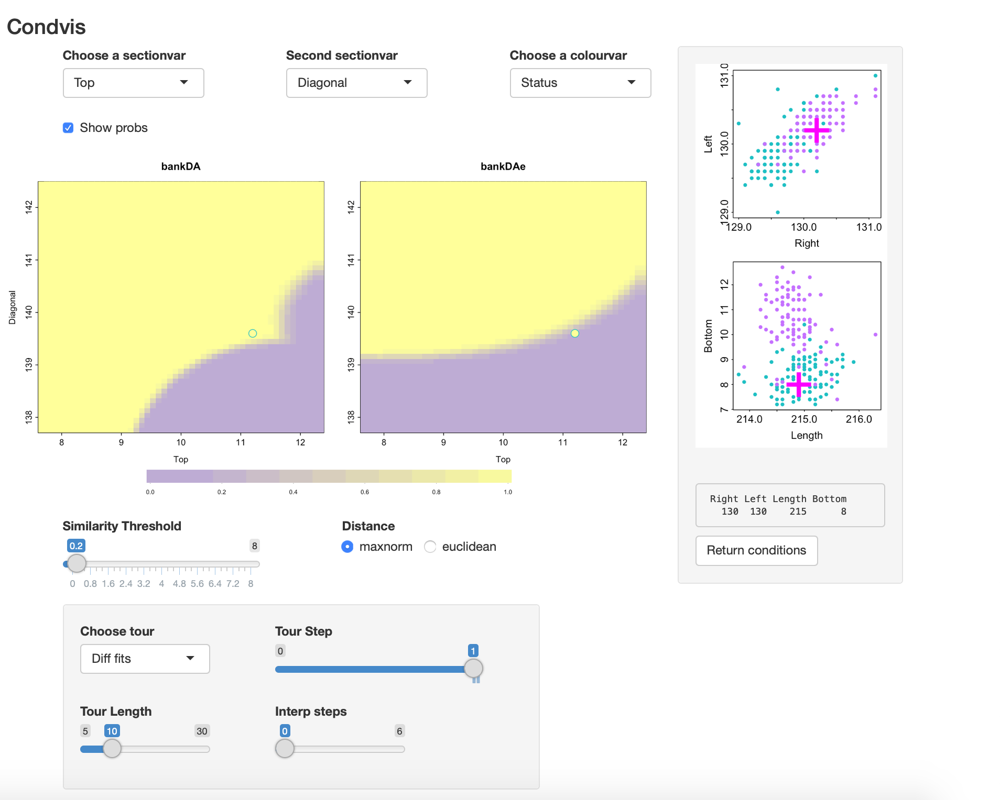
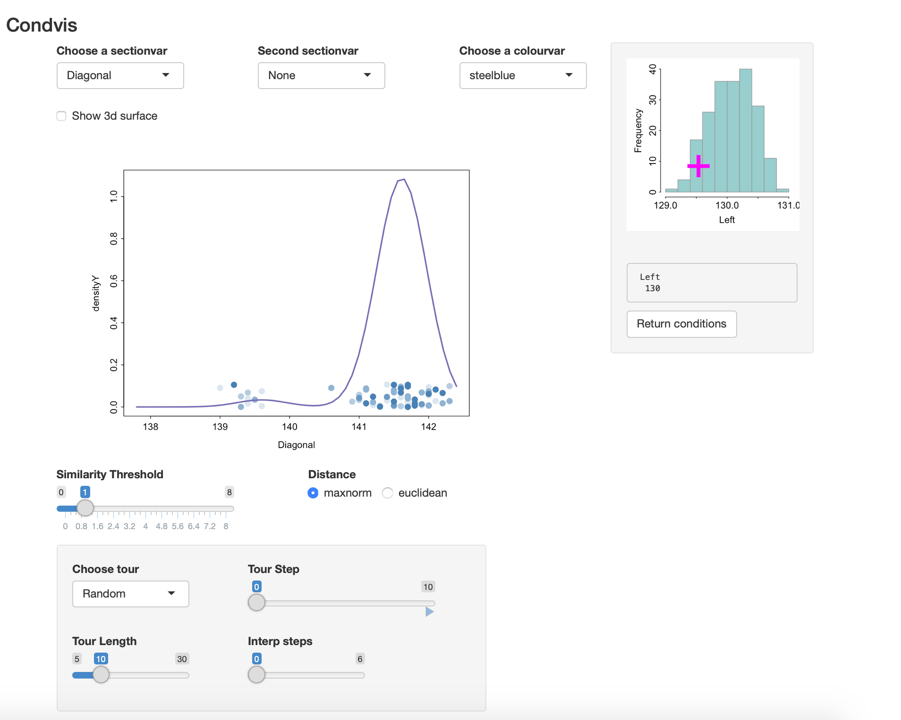
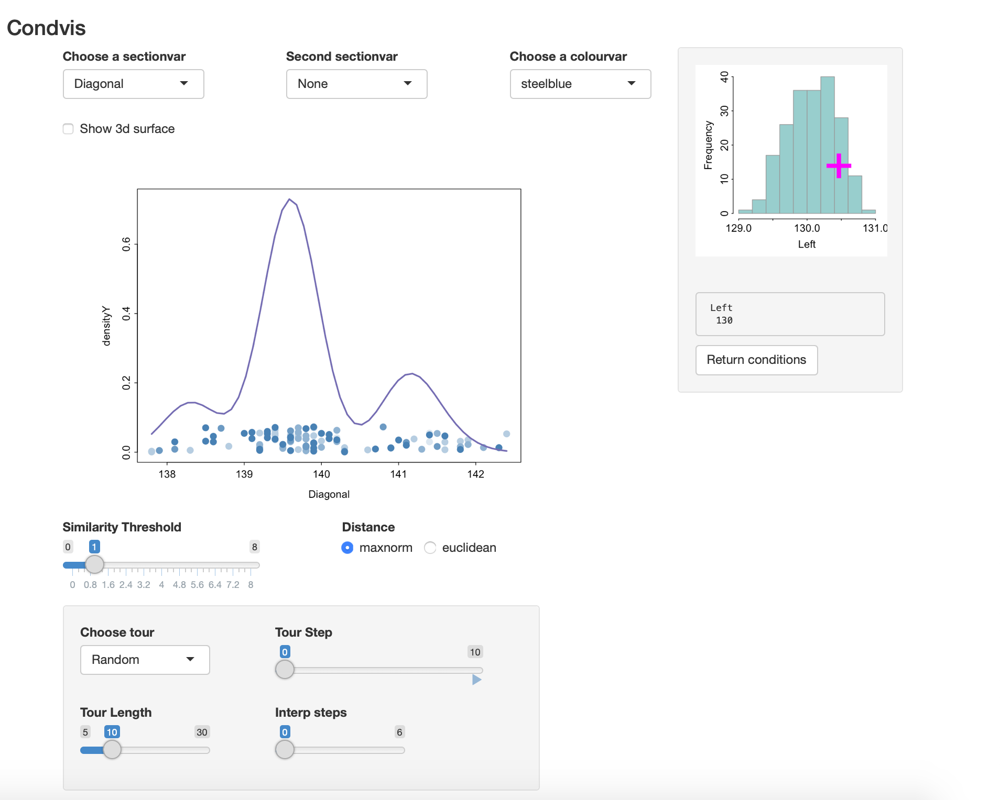
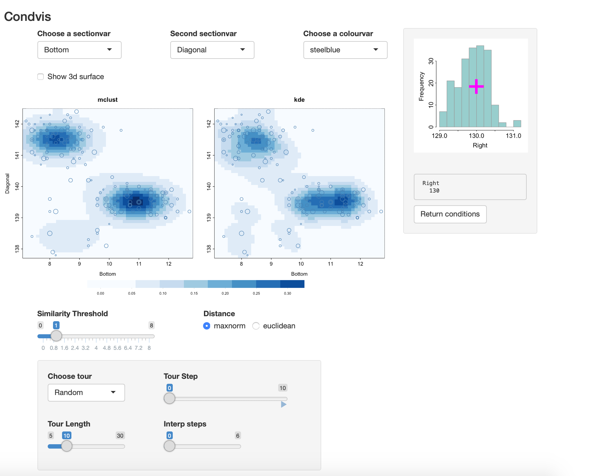

```{r setup, include = FALSE}
knitr::opts_chunk$set(
  collapse = TRUE,
  comment = "#>",
  fig.width=5, fig.height=5 ,fig.align="center"
)
```

`mclust` is a R package that offers
- model-based clustering: `Mclust`
- classification ( discriminant analysis): `MclustDA`
- density estimation `densityMclust`
all based on mixtures of Normals.

`condvis2` offers an interface to all of these.

We start with 

## Classification: MclustDA

```{r}
library(condvis2)
library(mclust)
```

```{r}
data(banknote)
bankDA <- MclustDA(banknote[,-1], banknote[,1],verbose=F)
```

This fits an XXX=ellipsoidal multivariate normal for the genuine notes and
EVE2 = ellipsoidal, equal volume and equal shape with two components for
 counterfeits.


Condvis uses a generic `CVpredict` to provide a uniform interface to `predict` methods.
We will use it to find the number of misclassifications:

```{r}
table(banknote$Status, CVpredict(bankDA, banknote))
```

```{r echo=F, eval=F}
bankDA$models$genuine$modelName
bankDA$models$genuine$G

bankDA$models$counterfeit$modelName
bankDA$models$counterfeit$G

bankDA$models$counterfeit
```


```{r eval=F}
svars <- c("Top", "Diagonal")
cvars <- setdiff(names(banknote)[-1], svars)
condvis(data = banknote, model = bankDA, 
        response="Status", sectionvars=svars,conditionvars=cvars, 
        pointColor="Status", showsim=TRUE
        )
```


The `showsim=TRUE` setting means that the condition plots will mark points considered
sufficiently near the section with a dark outline. This is the default setting only
when $n <= 150$. One the condition plots, the green points are the genuine ones, pink
are counterfeit.

Here is a views of the result:

```{r echo=FALSE, out.width='100%'}

```
There is one point that appears to be mis-classified (though it is not). 
However, as it's size is small it is not very close
to the selected section.

Selecting `Show probs`: we see there is some uncertainty about the classification on the classification
boundaries.


A different, simpler fit is got using

```{r}
bankDAe <- MclustDA(banknote[,-1], banknote[,1], modelType="EDDA",verbose=F)
```

This uses an EVE1 for each class, and there is one mis-classification, at case 70.


We can use condvis to compare the two fits:

```{r eval=F}
condvis(data = banknote, model = list(bankDA=bankDA, bankDAe=bankDAe), 
        response="Status", sectionvars=svars,conditionvars=cvars, 
        pointColor="Status", showsim=T
        )
```

If you go to Tour, `Diff fits`, you can move through views where the
conditioning points are those where the fits disagree. In this case there is
only one such point.
Here `Show probs` is selected so there is some uncertainty visible at the classification
boundaries.

The screenshot shows that in this view.
```{r echo=FALSE, out.width='100%'}

```

The mis-classified point is a genuine note (green) which is just inside the
region classified as counterfeit by EDDA.
Here also the Similarity threshold is made small so only the point on the section is visible
in the section plot.
From the condition plots it is evident this note has a low  Diagonal size, like the
counterfeits.


## Density estimation

First calculate a density estimate of two variables.
```{r}
data(banknote)
dens2 <- densityMclust(banknote[,c("Diagonal","Left")],verbose=F) 
summary(dens2)
```

We can visualise the density as a surface or contour plot.
Alternatively, we can use condvis to show the conditional
density, fixing one of the variables.

```{r eval=F}
condvis(data = banknote, model = dens2, response=NULL,
        sectionvars="Diagonal",conditionvars="Left",
        density=T, showdata=T)
```

The density of Diagonal varies with the Left value, from
```{r echo=FALSE, out.width='100%'}

```
to 

```{r echo=FALSE, out.width='100%'}

```

Estimating the density of three variables:

```{r}
dens3 <- densityMclust(banknote[,c("Right", "Bottom", "Diagonal")],verbose=F) 
summary(dens3)
```

By way of comparison, here is the kernel density estimate to compare with mclust:

```{r}
library(ks)
kdens3 <- kde(banknote[,c("Right", "Bottom", "Diagonal")])
```

```{r eval=F}
condvis(data = banknote, model = list(mclust=dens3, kde=kdens3), response=NULL,
        sectionvars=c("Bottom", "Diagonal"),conditionvars="Right",
        density=T, showdata=T)
```

As you vary the level of Right, both densities look quite similar.

```{r echo=FALSE, out.width='100%'}

```
<!-- https://www.ncbi.nlm.nih.gov/pmc/articles/PMC5096736/ -->
